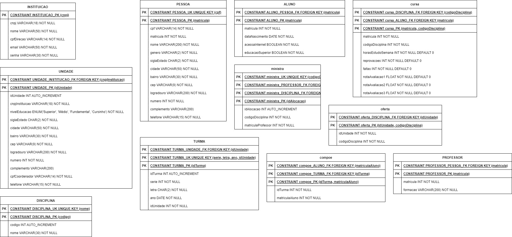

# Visão Geral da Arquitetura de Software

Este documento apresenta a arquitetura de software adotada para o projeto, que se baseia em um monolito que combina React para o front-end e FastAPI para o back-end, com dados armazenados no MySQL. Além disso, o documento apresenta o rich picture, o diagrama de pastas, o modelo entidade-relacionamento (ME-R), o diagrama entidade-relacionamento (DE-R) e o diagrama lógico de dados (DLD).

## Tecnologias Utilizadas

### React

O [React](https://react.dev) é uma biblioteca JavaScript de código aberto para criar interfaces de usuário ou componentes de IU. É mantido pelo Facebook e por uma comunidade de desenvolvedores e empresas individuais. O React pode ser usado como uma base no desenvolvimento de aplicativos de página única ou móveis. A sua escolha foi devido à baixa curva de aprendizado, popularidade no mercado, capacidade de personalização e familiaridade por parte de algum dos membros da equipe.

### FastAPI

O [FastAPI](https://fastapi.tiangolo.com) é um framework web de alto desempenho, fácil de aprender, rápido para codificar, pronto para produção, baseado em Python 3.6+ e que suporta tipos de dados de anotação de tipo padrão. Ele foi escolhido por ser rápido, fácil de aprender, escalável e por suportar anotações de tipo padrão.

### MySQL

O [MySQL](https://dev.mysql.com/doc/) é um sistema de gerenciamento de banco de dados relacional de código aberto. Ele foi escolhido por ser rápido, confiável, escalável e por possuir uma interface gráfica para gerenciamento de dados.

### Jupyer Notebook

O [Jupyter Notebook](https://jupyter.org) é um aplicativo da web de código aberto que permite criar e compartilhar documentos que contêm código ativo, equações, visualizações e texto narrativo. Os usos incluem: limpeza e transformação de dados, simulação numérica, modelagem estatística, visualização de dados, aprendizado de máquina e muito mais. Ele foi escolhido por ser uma ferramenta de fácil utilização que permite o treinamento de modelos de aprendizado de máquina, juntamente com bibliotecas Python tais como Numpy, Pandas, Scikit-learn e Tensorflow.

## Rich Picture

## Diagrama de Pastas

## Modelagem e Desenho do Banco de Dados
#### Entidades

* *Escola*:  A entidade "Escola" representa a instituição de ensino particular afetada pelo problema. 

* *Unidade*: A entidade "Unidade da Escola" se refere às diferentes divisões ou campus da escola. Ela pode conter informações sobre localização geográfica, estrutura física e recursos disponíveis em cada unidade.

* *Pessoa*: A entidade "Pessoa" é uma entidade abstrata que engloba tanto "Aluno" quanto "Professor". Ela representa indivíduos associados à escola que serão objetos de análise e previsão.
  
  * Aluno: A entidade "Aluno" representa os estudantes matriculados na escola. Ela contém informações pessoais dos alunos.

  * Professor: A entidade "Professor" representa os educadores da escola. Ela inclui informações sobre o corpo docente.

* *Turma*: A entidade "Turma" engloba grupos de alunos que frequentam as disciplinas juntos.

* *Disciplina*: A entidade "Turma" engloba grupos de alunos que frequentam as disciplinas juntos.

* *Avalição*:  A entidade "Avaliação" contém informações sobre as avaliações realizadas nas disciplinas, como provas, trabalhos e notas. 

#### Atributos

**ESCOLA**:

- CNPJ: Número de Identificação Fiscal da escola.
- Nome: Nome da escola.
- CPF da Direção: Número de Identificação Fiscal do diretor da escola.

**UNIDADE**:

- ID da Unidade: Identificador único da unidade.
- Nível de Educação: Nível de ensino oferecido pela unidade.
- Telefone (opcional): Número de telefone da unidade.
- Endereço: Informações sobre o endereço da unidade, incluindo sigla do estado, cidade, bairro, CEP, logradouro, número e complemento.
- CPF do Coordenador: Número de Identificação Fiscal do coordenador da unidade.

**PESSOA**:

- CPF: Número de Identificação Fiscal da pessoa.
- Matrícula: Número de matrícula da pessoa.
- Nome: Nome da pessoa.
- Gênero: Gênero da pessoa.
- Telefone (opcional): Número de telefone da pessoa.
- Endereço: Informações sobre o endereço da pessoa, incluindo sigla do estado, cidade, bairro, CEP, logradouro, número e complemento.

**ALUNO**:

- Data de Nascimento: Data de nascimento do aluno.
- Acesso à Internet: Indicação se o aluno possui acesso à internet.

**PROFESSOR**:

- Formação: Nível de formação e qualificação do professor.

**TURMA**:

- ID da Turma: Identificador único da turma.
- Série: Série da turma.
- Letra: Letra que distingue turmas da mesma série.
- Ano: Ano letivo da turma.
- Unidade: Unidade à qual a turma está vinculada.

**DISCIPLINA**:

- Código: Código único da disciplina.
- Nome: Nome da disciplina.

**AVALIAÇÃO**:

- ID da Avaliação: Identificador único da avaliação.
- Tipo: Tipo de avaliação (por exemplo, prova, trabalho).
- ID da Disciplina: Identificador da disciplina à qual a avaliação está associada.
- Peso: Peso da avaliação no cálculo da nota final.

#### Relacionamentos

1. **ESCOLA - tem - UNIDADE (1:n)**
   - **Descrição**: Uma escola tem uma ou mais unidades, e uma unidade pertence somente a uma escola. Isso indica a relação de propriedade das unidades em relação à escola.

2. **UNIDADE - oferta - DISCIPLINA (n:m)**
   - **Descrição**: Uma unidade oferta várias disciplinas, e uma disciplina pode ser ofertada por várias unidades. Esse é um relacionamento de muitos-para-muitos, indicando que várias unidades oferecem várias disciplinas.

3. **UNIDADE - possui - TURMA (1:n)**
   - **Descrição**: Uma unidade possui várias turmas, e uma turma é possuída por somente uma unidade. Isso representa a relação entre as unidades e as turmas que estão sob a administração de cada unidade.

4. **PROFESSOR - leciona - DISCIPLINA (n:m) => entidade relacional**
   - **Descrição**: Um professor leciona uma ou mais disciplinas, e uma disciplina pode ser lecionada por vários professores. Para representar um relacionamento muitos-para-muitos entre professores e disciplinas, você pode usar uma entidade relacional intermediária para registrar essas associações.

5. **ALUNO - compõe - TURMA (n:m)**
   - **Descrição**: Um aluno compõe uma ou mais turmas, e uma turma é composta por vários alunos. Isso denota a relação de pertencimento dos alunos às turmas em que estão matriculados.

6. **TURMA - cursa - DISCIPLINA (n:m)**
   - **Descrição**: Uma turma cursa uma ou mais disciplinas, e uma disciplina pode ser cursada por várias turmas. Isso representa a relação entre as turmas e as disciplinas que são ministradas dentro de cada turma.
### Diagrama Lógico de Dados (DLD)

## Referências Bibliográficas

1. https://fastapi.tiangolo.com
1. https://react.dev/learn
1. https://dev.mysql.com/doc/
1. https://numpy.org/doc/
1. https://pandas.pydata.org/docs/
1. https://scikit-learn.org/stable/
1. https://www.tensorflow.org/api_docs

## Versionamento

| Versão | Data       | Modificação                                                            | Autor                  |
| ------ | ---------- | ---------------------------------------------------------------------- | ---------------------- |
| 1.0    | 20/08/2023 | Criação do conteúdo                                                    | Fause Carlos           |
| 1.1    | 21/08/2023 | Melhoria da formatação e conteúdo                                      | Luís Lins              |
| 1.2    | 06/09/2023 | Adição de texto introdutório                                           | Carlos Vaz             |
| 2.0    | 14/09/2023 | Adição da descrição das tecnologias, rich picture e diagrama de pastas | Luís Lins, Renan Girão |
| 2.1    | 15/09/2023 | Adição do DE-R e DLD                                                   | Luís Lins, Renan Girão |
| 3.0    | 03/11/2023 | Correção do desenho do banco                                                   | Luís Lins |
