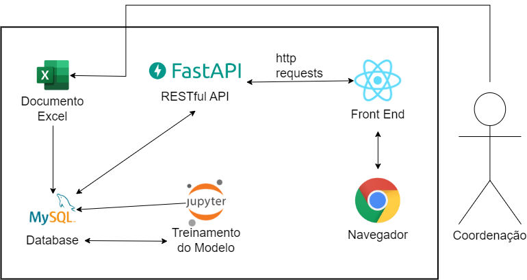
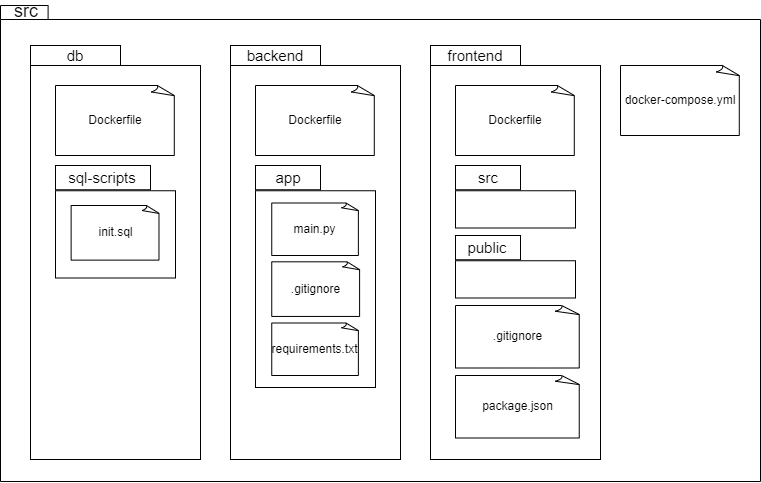
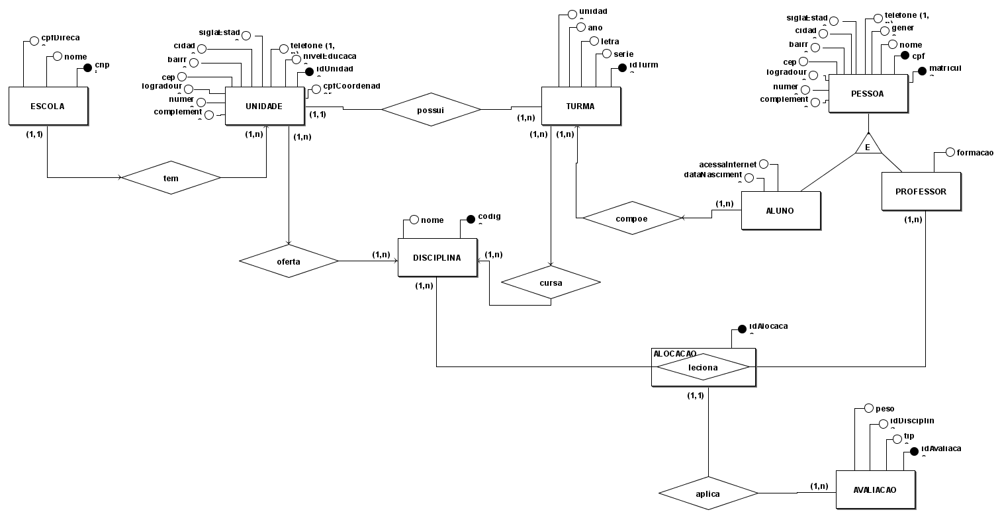
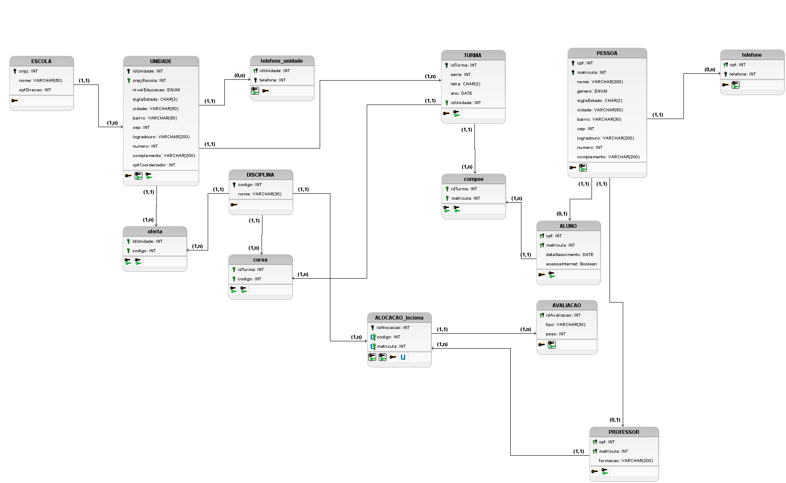

# Visão Geral da Arquitetura de Software

Este documento apresenta a arquitetura de software adotada para o projeto, que se baseia em um monolito que combina React para o front-end e FastAPI para o back-end, com dados armazenados no MySQL. Além disso, o documento apresenta o rich picture, o diagrama de pastas, o modelo entidade-relacionamento (ME-R), o diagrama entidade-relacionamento (DE-R) e o diagrama lógico de dados (DLD).

## Tecnologias Utilizadas

### React

O [React](https://react.dev) é uma biblioteca JavaScript de código aberto para criar interfaces de usuário ou componentes de IU. É mantido pelo Facebook e por uma comunidade de desenvolvedores e empresas individuais. O React pode ser usado como uma base no desenvolvimento de aplicativos de página única ou móveis. A sua escolha foi devido à baixa curva de aprendizado, popularidade no mercado, capacidade de personalização e familiaridade por parte de algum dos membros da equipe.

### FastAPI

O [FastAPI](https://fastapi.tiangolo.com) é um framework web de alto desempenho, fácil de aprender, rápido para codificar, pronto para produção, baseado em Python 3.6+ e que suporta tipos de dados de anotação de tipo padrão. Ele foi escolhido por ser rápido, fácil de aprender, escalável e por suportar anotações de tipo padrão.

### MySQL

O [MySQL](https://dev.mysql.com/doc/) é um sistema de gerenciamento de banco de dados relacional de código aberto. Ele foi escolhido por ser rápido, confiável, escalável e por possuir uma interface gráfica para gerenciamento de dados.

### Jupyer Notebook

O [Jupyter Notebook](https://jupyter.org) é um aplicativo da web de código aberto que permite criar e compartilhar documentos que contêm código ativo, equações, visualizações e texto narrativo. Os usos incluem: limpeza e transformação de dados, simulação numérica, modelagem estatística, visualização de dados, aprendizado de máquina e muito mais. Ele foi escolhido por ser uma ferramenta de fácil utilização que permite o treinamento de modelos de aprendizado de máquina, juntamente com bibliotecas Python tais como Numpy, Pandas, Scikit-learn e Tensorflow.

## Rich Picture

## Diagrama de Pastas

## Modelagem e Desenho do Banco de Dados

### Modelo Entidade-Relacionamento (ME-R)

#### Entidades

#### Atributos

#### Relacionamentos

### Diagrama Entidade-Relacionamento (DE-R)

### Diagrama Lógico de Dados (DLD)

## Referências Bibliográficas

1. https://fastapi.tiangolo.com
1. https://react.dev/learn
1. https://dev.mysql.com/doc/
1. https://numpy.org/doc/
1. https://pandas.pydata.org/docs/
1. https://scikit-learn.org/stable/
1. https://www.tensorflow.org/api_docs

## Versionamento

| Versão | Data       | Modificação                                                            | Autor                  |
| ------ | ---------- | ---------------------------------------------------------------------- | ---------------------- |
| 1.0    | 20/08/2023 | Criação do conteúdo                                                    | Fause Carlos           |
| 1.1    | 21/08/2023 | Melhoria da formatação e conteúdo                                      | Luís Lins              |
| 1.2    | 06/09/2023 | Adição de texto introdutório                                           | Carlos Vaz             |
| 2.0    | 14/09/2023 | Adição da descrição das tecnologias, rich picture e diagrama de pastas | Luís Lins, Renan Girão |
| 2.1    | 15/09/2023 | Adição do DE-R e DLD                                                   | Luís Lins, Renan Girão |
