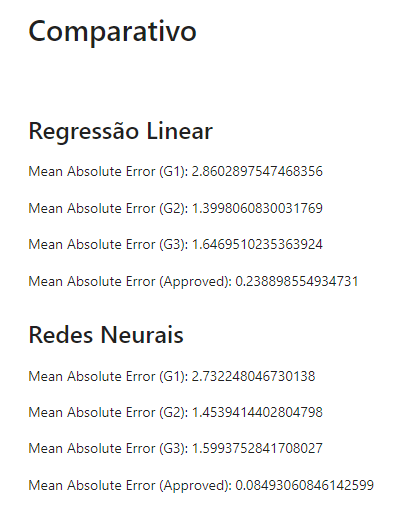
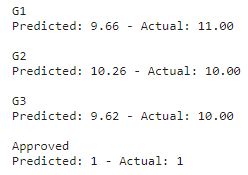

# Documentação do Notebook

Este documento apresenta uma visão geral do notebook "Comparação de Desempenho entre Regressão Linear e Rede Neural"[1]. O notebook foi criado para analisar o desempenho comparativo entre um modelo de regressão linear e uma rede neural na previsão das notas G1, G2 e G3 dos alunos, utilizando o conjunto de dados de desempenho do aluno disponível no Kaggle[2].

## Resumo do Notebook

O notebook consiste em uma série de etapas que incluem a importação e exploração dos dados, análise exploratória, construção e treinamento de modelos de regressão linear e rede neural, avaliação dos modelos e comparação dos resultados.

## Etapas do Notebook

1. **Preparação dos Dados**: Os dados foram importados utilizando a biblioteca Pandas e passaram por uma análise inicial para entender sua estrutura e características.

2. **Análise Exploratória de Dados (EDA)**: Diversas visualizações foram criadas para investigar as distribuições das notas G1, G2 e G3, bem como as relações entre as variáveis independentes e dependentes.

3. **Modelo de Regressão Linear**: Foi construído um modelo de regressão linear utilizando a biblioteca scikit-learn. O modelo foi ajustado aos dados de treinamento e avaliado com métricas relevantes.

4. **Modelo de Rede Neural**: Uma rede neural foi implementada utilizando TensorFlow. A arquitetura da rede foi definida e o modelo foi treinado utilizando os conjuntos de treinamento e teste.

5. **Comparação de Resultados**: Os resultados dos dois modelos foram comparados com base em métricas como o Erro Médio Absoluto (MAE) e o Erro Quadrático Médio (MSE) nos conjuntos de teste.

## Resultados do treinamento dos modelos

Com base na análise realizada no notebook, podemos concluir que o modelo de rede neural obteve um melhor resultado na previsão das notas G1, G2 e G3. Essa conclusão foi obtida após avaliar as métricas de avaliação nos conjuntos de teste, vide imagem abaixo:

## Previsões de um aluno aleatório

## Conclusão

Dado o conjunto de dados citados e o nosso modelo de rede neural, tal como o de regressão linear, temos uma precisão muito elevada na previsão da nota dos estudantes, de forma que podemos utilizá-lo para prever o desempenho dos alunos e, assim, identificar padrões de comportamento e fatores que levam ao baixo desempenho, evasão e inadimplência dos alunos matriculados.

## Referências

[1]: [Link para o Notebook](https://www.kaggle.com/code/zeppellinn/student-perfomance)

[2]: [Link para o Conjunto de Dados](https://www.kaggle.com/datasets/devansodariya/student-performance-data)

## Versionamento

| Versão | Data       | Modificação         | Autor     |
| ------ | ---------- | ------------------- | --------- |
| 1.0    | 09/08/2023 | Criação do conteúdo | Luís Lins |
