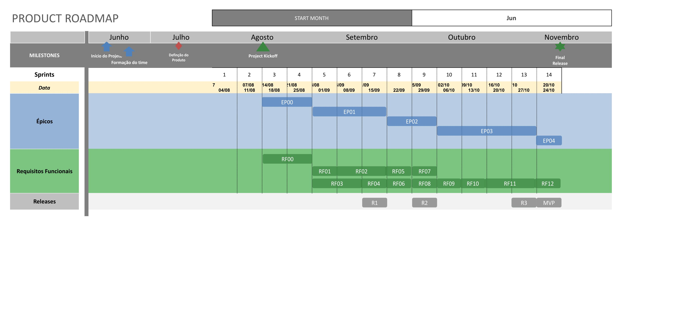

# Roadmap

Este documento visa representação visual que detalha as atualizações e os aprimoramentos planejados para o projeto. Ele fornece uma visão geral das próximas funcionalidades e melhorias de desempenho que estão em desenvolvimento ou planejadas para o futuro, permitindo que os usuários acompanhem o progresso de desenvolvimento do produto.

## Sobre

Um roadmap é essencialmente um guia visual ou um plano de ação que destaca as etapas importantes, metas e os prazos ao longo do período de tempo de um projeto. Ele nos oferece uma visão geral das etapas necessárias para alcançar concluir um projeto.

Para vizualizar o nosso roadmap <a href="https://github.com/ResidenciaTICBrisa/06_AcompanhamentoEnsinoMedio/blob/docs/docs/documentos/roadmap.pdf" download>clique aqui</a> ou veja abaixo:

## Versionamento

| Versão | Data       | Modificação                         | Autor       |
| ------ | ---------- | ----------------------------------- | ----------- |
| 1.0    | 20/08/2023 | Criação do conteúdo                 | Mariana Rio |
| 2.0    | 21/08/2023 | Correção da visualização do Roadmap | Luís Lins   |
| 3.0    | 06/09/2023 | Adição de texto introdutório        | Carlos Vaz  |
